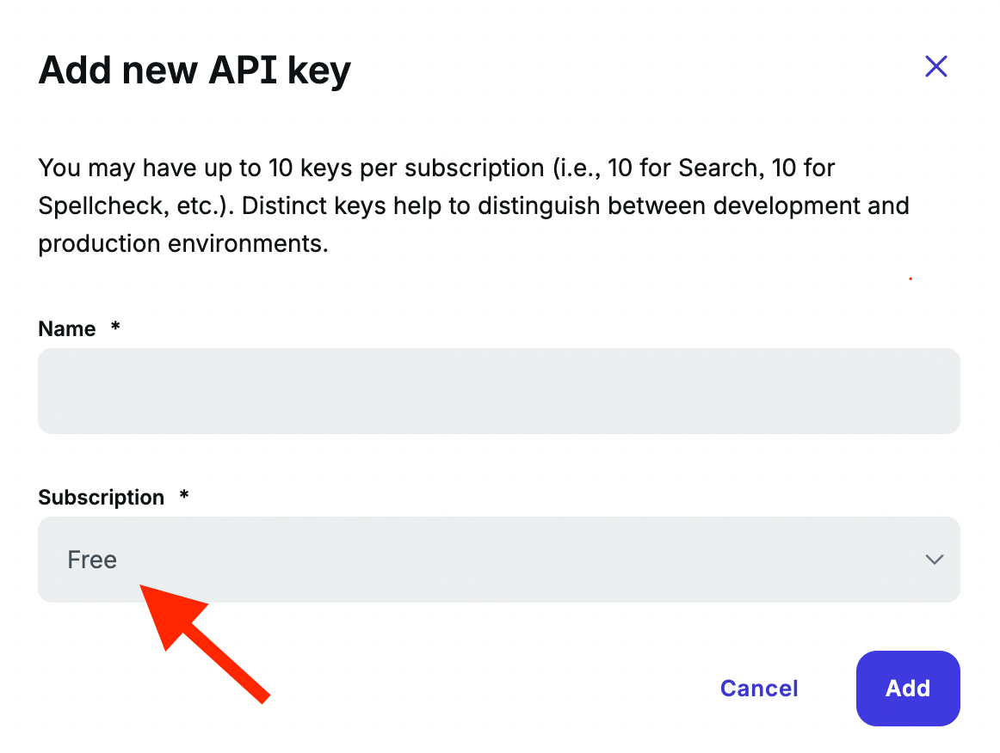

# Brave Search API Guide

## Register Brave Search API account

1. Go to [Brave Search API](https://brave.com/search/api/) and Sign Up for the account
2. Make sure you activate your account
3. Login to your account (Brave will send you verification code)

> **Note:** You will need a credit card to subscribe to free plans. This is required by Brave for verification purposes, but the free tier quotas are generous enough for typical usage without charges.

## Subscribe to Free plans

1. Go to [Subscriptions](https://api-dashboard.search.brave.com/app/subscriptions/subscribe) on the menu once you're logged in
2. Subscribe to:
   - Data for Search (Free)
   - Data for AI (Free)
   - Spellcheck (Free Spellcheck)
   - Suggest (Free Autosuggest)

Each time you subscribe to a free plan you will be asked to provide card details. This step is unfortunately required by Brave for verification.

**Free Tier Quotas:**
- **Data for Search**: 2,000 requests/month (1 req/sec)
- **Data for AI**: 2,000 requests/month (1 req/sec)
- **Spellcheck**: 5,000 requests/month (5 req/sec)
- **Autosuggest**: 5,000 requests/month (5 req/sec)

**Recommendations:**
- **Minimum required**: Data for Search (Argus won't work without this)
- **Highly recommended**: Data for AI (provides 6x more context with extra snippets)
- **Optional**: Spellcheck and Autosuggest (useful but not essential)

## Generate API keys

Once you subscribed to the plans - go to [API Keys](https://api-dashboard.search.brave.com/app/keys) on the menu.

Generate Keys for each Subscription giving it a name.

(CLICK ME)

> NOTE: You need to select from the dropdown the subscription you're generating API Key for.

If you subscribed to all Free subscriptions then dropdown should have these options:

- **Free** → This is your `X-Brave-API-Key-Search` for `.mcp.json` and `X_BRAVE_API_KEY_SEARCH` for `.env`
- **Free AI** → This is your `X-Brave-API-Key-AI` for `.mcp.json`
- **Free Autosuggest** → This is your `X-Brave-API-Key-Autosuggest` for `.mcp.json`
- **Free Spellcheck** → This is your `X-Brave-API-Key-Spellcheck` for `.mcp.json`

### Why the same Search key in two places?

The Search API key appears in both `.env` and `.mcp.json` for different purposes:

- **`.env` (Startup Key)**: Used only during Docker container startup to display current API usage in logs. This is optional - tools work without it, but you'll see `0/2000` usage stats if missing.

- **`.mcp.json` (Runtime Keys)**: Used for actual API calls from MCP tools. These keys are sent per-request via HTTP headers and are never stored in the container.

**Why separate?**
- Docker container starts **before** any HTTP requests arrive
- Startup usage check needs a key (no `.mcp.json` headers available yet)
- Runtime tools use per-request keys from `.mcp.json` headers
- This keeps the container stateless and secure

---

And you're done! Paste those API Keys into your `.mcp.json` (and Search Key to `.env` for startup stats) and you are ready to go!
